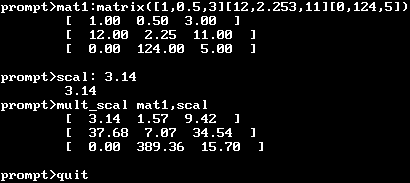

# minicas

Interpréteur en ligne de commande de calcul matriciel de base

## À propos

Dans le cadre de notre projet universitaire en deux étapes, nous avons dans un premier temps développé une bibliothèque de fonctions en C permettant d'effectuer divers calculs matriciels. Puis, nous avons conçu un interpréteur de commandes se servant cette bibliothèque pour proposer à l'utilisateur un environnement de calcul simple et intuitif.

## Compilation et exécution

Le fichier *Makefile* fourni permet facilement de compiler **minicas**. Néanmoins, ce dernier utilise l'outil **gnuplot** qui est nécessaire d'installer avant l'exécution de **minicas** !

Pour exécuter l'interpréteur, tapez la commande suivante :

```./minicas [fichier source]```

Par défaut, **minicas** s'attend à recevoir des commandes depuis l'entrée standard. Si un fichier source est spécifié au lancement, les commandes vont être lues depuis ce dernier.

## Syntaxe

### Déclaration de variables

Un scalaire se déclare comme suit `<nom>: <valeur>` où *valeur* est un entier ou un flottant.

Pour définir une matrice il faut utiliser la syntaxe `<nom>: matrix([a, b, ...][c, d, ...]...)` où *a*, *b*, *c*, et *d* représentent des sclaires.

Dans la suite, soient *m*, *m1* et *m2* trois matrices quelconques.

### Opérations sur des matrices et des scalaires

- addition de *m1* à *m2* : `addition m1,m2`
- soustraction de *m2* de *m1* : `sub m1,m2`
- multiplication de *m1* par *m2* : `mult m1,m2`
- multiplication de de *m1* par le scalaire *s* : `mult_scal m1,s`

### Fonctions

- calcul de l'exposant de *m* : `expo m`
- transposition de *m* : `transpose m`
- calcul du déterminant de *m* : `determinant m`
- solution d'un système linéaire *AX = B* : `solve A,B`
- calcul du rank de *m* : `rank m`
- inversion de *m* : `invert m`
- calcul de la valeur propre maximale et du vecteur propre de *m* : `eigen m`
- calcul des coefficients de la droite de régression linéaire et du vecteur des résidus de *m* : `least_estimate m`

### Tests de performance

Afin d'effectuer un test de performance d'une des fonctions précédentes, l'utilisateur peut se servir de la commande *speedtest* ayant la syntaxe suivante :

```speedtest <commande> <min> <max> <pas> <secs>```

Ici, *commande* représente le nom de la commande à stresser, *min* et *max* désignent respectivement la taille minimale et maximale de la matrice à tester, *pas* définit la vitesse d'agrandissement de la matrice de test et *secs* est la limite en secondes pour effectuer le test (si l'exécution dure au-delà elle sera arrêtée prématurément).

Notons que les résultats de tests sont enregistrés dans un fichier créé automatiquement dans le répertoire où se trouve l'exécutable de **minicas**.

### Fermeture de **minicas**

Tapez la commande `quit`.

## Exemple d'utilisation



## Auteurs

[Marek Felsoci](mailto:marek.felsoci@etu.unistra.fr) et Paul Viville, étudiants à l'[Université de Strasbourg](http://www.unistra.fr).

## Licence

Les sources de ce projet sont disponibles sous la licence GNU GPLv2 (voir le fichier [LICENSE](LICENSE) dans ce dépôt).
